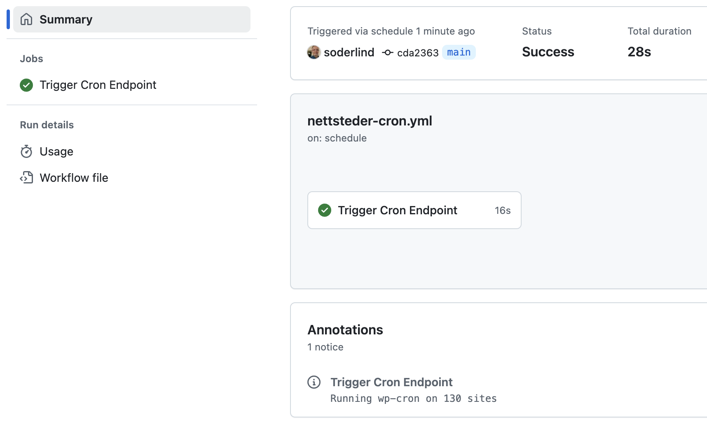

# All Sites Cron

Run wp-cron on all public sites in a multisite network (REST API based)

> "You could have done this with a simple cron job. Why use this plugin?" I have a cluster of WordPress sites. I did run a shell script calling wp cli, but the race condition was a problem. I needed a way to run wp-cron on all sites without overlapping. This plugin was created to solve that problem.

## 🚀 Quick Start

1. Upload `all-sites-cron` to `/wp-content/plugins/`
2. Network activate via 'Network->Plugins'
3. Disable WordPress default cron in `wp-config.php`:
   ```php
   define( 'DISABLE_WP_CRON', true );
   ```

Also available via Composer:

```bash
composer require soderlind/all-sites-cron
```

## 🔧 Configuration

The plugin exposes a REST API route that triggers cron across your network.

JSON usage:

```
https://example.com/wp-json/all-sites-cron/v1/run
```

GitHub Actions plain text (add `?ga=1`):

```
https://example.com/wp-json/all-sites-cron/v1/run?ga=1
```

Adding `?ga=1` outputs results in GitHub Actions compatible format:

- Success: `::notice::Running wp-cron on X sites`
- Error: `::error::Error message`

  Example GitHub Action success notice:

  

## ⏰ Trigger Options

1. System Crontab (every 5 minutes):

```bash
*/5 * * * * curl -s https://example.com/wp-json/all-sites-cron/v1/run
```

2. GitHub Actions (every 5 minutes. 5 minutes is the [shortest interval in GitHub Actions](https://docs.github.com/en/actions/writing-workflows/choosing-when-your-workflow-runs/events-that-trigger-workflows#schedule)):

```yaml
name: DSS Cron Job
on:
  schedule:
    - cron: '*/5 * * * *'

env:
  CRON_ENDPOINT: 'https://example.com/wp-json/all-sites-cron/v1/run?ga=1'

jobs:
  trigger_cron:
    runs-on: ubuntu-latest
    timeout-minutes: 5
    steps:
      - run: |
          curl -X GET ${{ env.CRON_ENDPOINT }} \
            --connect-timeout 10 \
            --max-time 30 \
            --retry 3 \
            --retry-delay 5 \
            --silent \
            --show-error \
            --fail
```

## Customization

### Filters

Adjust maximum sites processed per request (default: 200):

```php
add_filter( 'dss_cron_number_of_sites', function( $sites_per_request ) {
	return 200;
});
```

Adjust transient expiration time (default: 1 hour):

```php
add_filter( 'dss_cron_sites_transient', function( $expiration ) {
	return 30 * MINUTE_IN_SECONDS; // change site list cache to 30 minutes
});

Rate limit (cooldown) between runs (default: 60 seconds):

```php
add_filter( 'dss_cron_rate_limit_seconds', function() {
    return 120; // 2 minutes
});
```

Request timeout per site (default: 0.01):

```php
add_filter( 'dss_cron_request_timeout', function() { return 0.05; });
```

### Interpreting Rate Limiting

If called again before the cooldown finishes the API returns HTTP 429 with JSON:

```json
{
  "success": false,
  "error": "rate_limited",
  "message": "Rate limited. Try again in 37 seconds.",
  "retry_after": 37,
  "cooldown": 60,
  "last_run_gmt": 1696071234,
  "timestamp": "2025-09-30 12:35:23"
}
```

Headers include: `Retry-After: <seconds>`.


## Benefits of REST mode (vs. original `/dss-cron` endpoint)

- No rewrite rules to flush: activation is simpler and avoids edge cases with 404s or delayed availability.
- No unexpected 301 canonical/trailing‑slash redirects: direct, cache‑friendly 200 responses.
- Versioned, discoverable endpoint (`/wp-json/all-sites-cron/v1/run`) integrates with the WP REST index and tooling.
- Consistent structured JSON by default plus optional GitHub Actions text via `?ga=1`.
- Proper HTTP status codes (e.g. 429 for rate limiting, 400 for invalid context) instead of a blanket 200.
- Easy extensibility: future endpoints (status, logs, defer mode, auth) can be added under the same namespace without new rewrites.
- Reduced theme / front‑end interference: bypasses template loading and front‑end filters tied to `template_redirect`.
- Better compatibility with CDNs and monitoring: REST semantics and headers are predictable and cache‑aware.
- Straightforward integration in external systems (CI/CD, orchestration) that already speak JSON.
- Built‑in argument handling and potential for schema/permission hardening via `permission_callback`.
- Clean separation of concerns: routing (REST) vs. execution logic (cron dispatcher) improves maintainability.
- Clear place to implement enhancements (rate limiting, future defer/background mode, auth tokens, metrics) with minimal risk.
- Easier automated testing using WP REST API test utilities (no need to simulate front‑end rewrite resolution).
- Avoids canonical redirect filter hacks previously needed to suppress 301s on `/dss-cron`.
- Safer for multi‑environment deployments (no dependency on rewrite flush timing during deploy pipelines).

## Copyright and License

All Sites Cron is copyright 2024 Per Soderlind

All Sites Cron is free software: you can redistribute it and/or modify it under the terms of the GNU General Public License as published by the Free Software Foundation, either version 2 of the License, or (at your option) any later version.

All Sites Cron is distributed in the hope that it will be useful, but WITHOUT ANY WARRANTY; without even the implied warranty of MERCHANTABILITY or FITNESS FOR A PARTICULAR PURPOSE. See the GNU General Public License for more details.

You should have received a copy of the GNU Lesser General Public License along with the Extension. If not, see http://www.gnu.org/licenses/.

---

### Migration Note

The plugin was renamed from "DSS Cron" (slug: `dss-cron`) to "All Sites Cron" (slug: `all-sites-cron`). The old REST namespace `dss-cron/v1` is still registered for backward compatibility, but you should migrate your automation scripts to use `all-sites-cron/v1`. Legacy WordPress filters like `dss_cron_number_of_sites` continue to work; new code should use the `all_sites_cron_*` equivalents.
