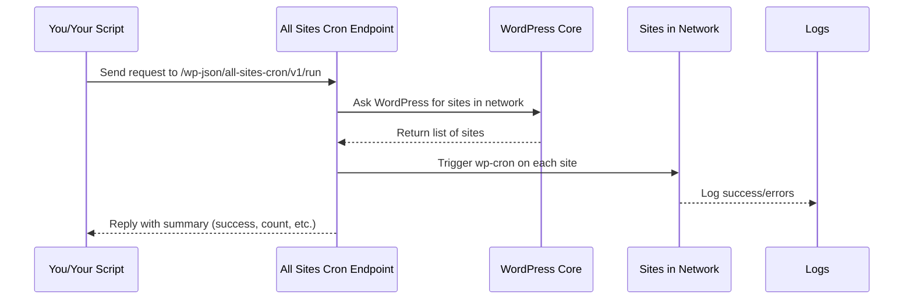

# Chapter 1: REST API Endpoint

Welcome to the first chapter of the **All Sites Cron** tutorial!

This chapter introduces the **REST API Endpoint**, the main "button" for triggering cron jobs on all sites in your WordPress multisite network. We'll break down what it is, why it's useful, and how you can use it — even if you've never worked with REST APIs before.

---

## Why Have a REST API Endpoint?

**Imagine you’re the caretaker of 100+ WordPress sites.** You want to make sure the internal tasks (like scheduled posts, email sending, etc.) run consistently on every site. In WordPress, these tasks are handled by something called “wp-cron”. But how do you reliably trigger wp-cron for all your sites at once?

- **The old way?** Set up lots of scripts, SSH into servers, or hope each site gets enough visitors to trigger its own cron tasks.
- **The easier way?** Use a single API endpoint—a special website URL—to command WordPress to run wp-cron on every site all together, whenever you want.

**That's what the REST API endpoint provides:**  
It acts just like a remote-control button, which you (or any automation tool) can press from anywhere, at any time.

---

## Key Concepts

Let’s break down the important pieces:

- **Endpoint**: A web address (URL) that you visit or send a request to.
- **Trigger**: Pressing the button (visiting the endpoint or sending a command) makes WordPress run tasks.
- **Parameters**: Extra options you add to your request to change how it works (like asking for quick feedback, or background processing).
- **Network**: All your connected WordPress sites (not just one site).

---

## Solving Our Use Case:  
**"I want to run wp-cron on every public site using a single button or a script."**

### Here’s How You Do It:

#### 1. Visit the Endpoint

Just open (or call) this special URL in a browser or with a tool like `curl`:
```
https://example.com/wp-json/all-sites-cron/v1/run
```
- Replace `example.com` with your real site.

#### 2. Optional: Add Parameters   
Modify behavior using:
- `?defer=1` — Process in the background (faster for you, great for big networks).
- `?ga=1` — Get plain text output for GitHub Actions (for automated scripts).

**Examples:**

```bash
# Basic usage (run now, get structured JSON reply)
curl https://example.com/wp-json/all-sites-cron/v1/run

# Run in background, quick reply ("deferred mode")
curl https://example.com/wp-json/all-sites-cron/v1/run?defer=1

# GitHub Actions output style
curl https://example.com/wp-json/all-sites-cron/v1/run?ga=1
```

---

### What Happens When You Call the Endpoint?

**Let’s follow the steps:**



**In other words:**  
When you call the endpoint, it will:
1. Check it's safe to run (not already running or rate-limited).
2. List all public sites.
3. Send a wp-cron trigger ("fire and forget") to each one.
4. Collect results (how many, errors).
5. Respond with a summary.

If you use `defer=1`, it will respond right away and finish the job in the background—a lifesaver for large networks!

---

## Example Inputs & Outputs

### Input Example:

Suppose you want a quick, background execution (for GitHub Actions or scheduling tools):

```bash
curl "https://example.com/wp-json/all-sites-cron/v1/run?defer=1"
```

### Output Example:

You get an immediate reply like:

```json
{
  "success": true,
  "status": "queued",
  "message": "Cron job queued for background processing",
  "timestamp": "2025-10-01 12:00:00",
  "mode": "deferred"
}
```

Or, if using `ga=1` (GitHub Actions plain text), you’d get something like:

```
::notice::Cron job queued for background processing
```

---

## A Peek Under the Hood

The main logic lives in the plugin’s main code ([see: all-sites-cron.php](all-sites-cron.php)), and works like this:

1. **Route Registration**: When WordPress loads, the plugin adds a new REST endpoint:  
   `/wp-json/all-sites-cron/v1/run`

   ```php
   register_rest_route('all-sites-cron/v1', '/run', [
      'methods' => 'GET',
      'callback' => 'rest_run',
      // ...other args
   ]);
   ```
   *This means WordPress now watches for requests to this address.*

2. **Request Processing**:  
   When you call the endpoint, the function `rest_run()` runs.

   ```php
   function rest_run( $request ) {
      // 1. Check if in multisite mode
      // 2. Acquire lock (so two jobs don't overlap)
      // 3. Check rate limit (so you don't run too often)
      // 4. If 'defer', start background job; else run cron now
      // 5. Return summary response
   }
   ```
   *This keeps things safe and ensures you don’t break your network!*

3. **Triggering Cron for All Sites**:  
   The heart of the plugin uses a simple loop:

   ```php
   foreach ( $sites as $site ) {
      $cron_url = $site_url . '/wp-cron.php?doing_wp_cron=...';
      wp_remote_post( $cron_url, [ 'timeout' => ..., 'blocking' => false ] );
   }
   ```
   *It triggers wp-cron for each site using a quick HTTP request.*

---

## Analogy Time!

**Think of the REST API endpoint as a remote TV controller:**
- You press “Play All”—it commands all TVs (sites) to start their show (jobs).
- You can add extra settings (like `defer=1`) for no waiting.
- It tells you the status back—either right away, or after the jobs are done.

---

## Internal Safety Features

To protect your network, the plugin also handles:
- **Locking**: Prevents overlapping jobs.
- **Rate Limiting**: Stops you from spamming the endpoint too often.
- **Batching**: Handles big networks in manageable groups.

*These advanced concepts will be covered in later chapters!*

---

## Wrapping Up

**You now know:**  
- What the REST API endpoint is,
- Why it’s the central “button” for multisite cron jobs,
- How to use it (with or without extra parameters),
- What happens behind the scenes!

In the [next chapter](02_github_actions___plain_output_mode_.md), we’ll see how this endpoint works especially well with automation tools like GitHub Actions, and explore plain text output mode for easy integration.

---

**Ready for automation and scripting?**  
Continue with: [GitHub Actions & Plain Output Mode](02_github_actions___plain_output_mode_.md)

---

Generated by [AI Codebase Knowledge Builder](https://github.com/The-Pocket/Tutorial-Codebase-Knowledge)