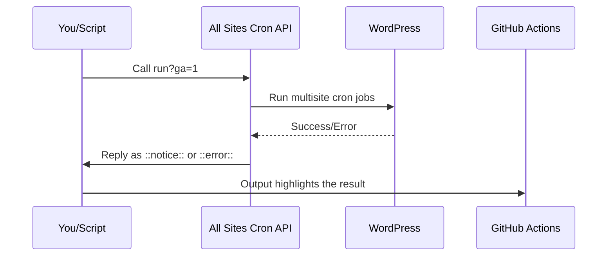

# Chapter 2: GitHub Actions & Plain Output Mode

Welcome to Chapter 2!  
In [Chapter 1: REST API Endpoint](01_rest_api_endpoint_.md), you learned how the **All Sites Cron** plugin lets you trigger network-wide cron jobs with a single special URL — perfect for automation.

But what if you want to run this from **GitHub Actions** or another script, and you need super simple, easy-to-read output? That’s where **Plain Output Mode (the `ga` parameter)** comes in.

---

## Why Use GitHub Actions & Plain Output Mode?

**The Problem:**  
Imagine you set up an automatic workflow using **GitHub Actions** to call your All Sites Cron endpoint every 5 minutes. Standard API responses are in JSON, which is great for developers. But many automation systems — like GitHub Actions, system crontabs, or status monitors — just want a simple **OK** or **ERROR** message. Even better, GitHub Actions understands special prefixes such as `::notice::` or `::error::` to highlight success or failure right inside your workflow logs.

**Central Use Case:**  
*“I want my automation or GitHub Actions workflow to run all multisite cron jobs and instantly see a simple success or error message, colored correctly in the workflow output — no JSON, no extra parsing.”*

---

## Key Concepts

Let’s break the idea into three simple concepts:

### 1. **Plain Output Mode (GitHub Actions Mode) via `?ga=1`**

Normally, API responses look like this:

```json
{
  "success": true,
  "count": 123,
  "message": "Cron job complete.",
  "timestamp": "2025-10-01 12:00:05"
}
```

But with **plain output mode**, you add `?ga=1` to your request:

```
https://example.com/wp-json/all-sites-cron/v1/run?ga=1
```

And get output like:

```
::notice::Running wp-cron on 123 sites
```

Or if there’s an error:

```
::error::Another cron process is currently running. Please try again later.
```

> **Analogy:** Think of this as flipping your response from a "detailed report" to a "sticky note": simple, direct, and meant to be seen by both humans and automation tools!

---

### 2. **Designed for Automation Tools (GitHub Actions, crontab, CI/CD, etc.)**

- **Automation** likes *plain* answers: Success? Error? That’s all it needs.
- GitHub Actions highlights these messages:  
  - `::notice::` shows up as a friendly message  
  - `::error::` makes the step show red for easy debugging
- System cron jobs and status monitors can easily parse simple lines.

---

### 3. **Combine with Deferred Mode for Fast, Reliable Automation**

Add `defer=1` as well for background processing (covered more in [Chapter 3: Deferred & Background Processing](03_deferred___background_processing_.md)):

```
https://example.com/wp-json/all-sites-cron/v1/run?ga=1&defer=1
```

This responds instantly with a readable notice while work happens safely in the background!

---

## How To Use Plain Output Mode

### 1. **Call the Endpoint with `?ga=1`**

Use `curl`, a script, or your GitHub Action workflow to call:

```bash
curl "https://example.com/wp-json/all-sites-cron/v1/run?ga=1"
```

**What you get:**

```
::notice::Running wp-cron on 123 sites
```

### 2. **For Background Processing**

Recommended for larger networks and quick GitHub Actions jobs:

```bash
curl "https://example.com/wp-json/all-sites-cron/v1/run?ga=1&defer=1"
```

**Typical output:**

```
::notice::Cron job queued for background processing
```

*This output returns almost instantly, while the actual cron jobs run behind-the-scenes.*

---

### 3. **GitHub Actions Setup Example**

Here's a minimal GitHub Actions step that triggers All Sites Cron and shows plain output in your workflow logs:

```yaml
- name: Trigger All Sites Cron (Plain Output)
  run: |
    curl -s "https://example.com/wp-json/all-sites-cron/v1/run?ga=1&defer=1"
```

**What happens:**  
If all is well, you’ll see a notice (in green!) in your GitHub Actions log:
```
::notice::Cron job queued for background processing
```
If there’s an error, it appears in red as an error.

---

## Internals: What Happens Under the Hood?

Let’s peek behind the scenes when you add `?ga=1` to your endpoint call.

**Sequence of Events:**



**Summary:**  
- The API runs cron jobs as usual, but formats the response as a simple line GitHub Actions will understand.
- Your workflow step just displays this line — no parsing or processing needed!

---

### Internal Implementation (How It Works)

Here’s the basic magic in PHP code (simplified):

```php
// 1. Detect if 'ga' (GitHub Actions/plain output) mode was requested
$ga_mode = (bool) $request->get_param('ga');

// 2. Run the cron as usual (details skipped)

// 3. Respond with plain GitHub Actions output if 'ga' mode
if ( $ga_mode ) {
    // Success example
    $txt = '::notice::Running wp-cron on 123 sites';
    return new \WP_REST_Response( $txt, 200 );
}
```
> *The plugin checks if you requested plain output, and simply returns a readable line with a special prefix.*

**How does it know when to send success/error?**  
- If everything worked, it uses `::notice::`  
- If there’s a problem (like another job running or rate limit), it sends `::error::` or even `::warning::`

---

## Handy Reference Table

| URL Parameter      | Output Type          | For Automation? | Example Output                         |
|--------------------|---------------------|-----------------|----------------------------------------|
| *none*             | JSON                | Manual use      | `{"success":true,"count":10...}`       |
| `?ga=1`            | Plain text (GA/CI)  | Yes             | `::notice::Running wp-cron on 10 sites`|
| `?ga=1&defer=1`    | GA + Background     | YES! Best combo | `::notice::Cron job queued for background processing` |

---

## Why This Matters

- **No need to parse JSON in your script** – it's ready for copy-paste.
- **Perfect for scheduled GitHub Actions or system crontab jobs.**
- **Instant, meaningful feedback:** green notices or red errors in your logs.
- **Works with other tools too:** any cron scheduler, UptimeRobot, EasyCron, bash, etc.

> **Analogy:**  
> Imagine a fancy coffee machine for your office building. Normally, it prints out a long, detailed receipt. With “plain mode”, you get a sticky note:  
> “Coffee’s ready for 123 people!”  
> Or, if out of beans:  
> “Error: Already making coffee, try again later.”

---

## Wrapping Up

In this chapter, you learned:

- How to use the `?ga=1` parameter for **easy, automation-friendly output**
- Why plain output is great for GitHub Actions, CI/CD, and scripts
- How the plugin detects this mode and formats replies simply
- How to combine it with background mode (defer)
- What actually happens under the hood

Ready to level up your automations with even faster, more robust background handling?  
Continue to [Deferred & Background Processing](03_deferred___background_processing_.md) to see how you can trigger hundreds of site cron jobs — without ever waiting!

---

**Next up:** [Deferred & Background Processing](03_deferred___background_processing_.md)

---

Generated by [AI Codebase Knowledge Builder](https://github.com/The-Pocket/Tutorial-Codebase-Knowledge)