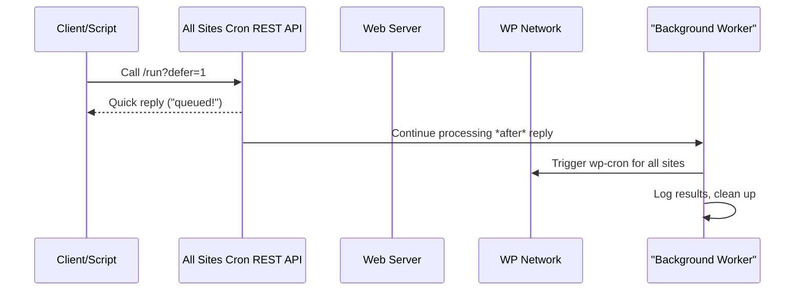

# Chapter 3: Deferred & Background Processing

In [Chapter 2: GitHub Actions & Plain Output Mode](02_github_actions___plain_output_mode_.md), you learned how to trigger **All Sites Cron** from automation tools and get super simple, script-friendly output. 

But…  
**What if your WordPress network is HUGE** and processing cron jobs for every site takes a long time?  
What if you *don’t* want your API script (or browser) to wait and wait (and maybe *timeout*) — you just want to “press the button,” get a quick confirmation, and let the server finish the heavy work in the background?

That’s exactly what **Deferred & Background Processing** solves!

---

## Why Deferred Processing? (The Problem & Use Case)

**Central Use Case:**  
*“I want to run wp-cron on every site in my WordPress network, but I don’t want to wait for all the work to finish. Just let me queue up the job, tell me ‘we got it,’ and handle the rest after I go.”*

- Large networks (50+ sites) can take many seconds or even minutes to fully process.
- Automated tools like GitHub Actions may *timeout* if requests are slow.
- Browsers and monitoring scripts just need a quick “We got your request!” and then move on.

**Deferred mode** lets the server handle all the hard work—quietly and reliably—AFTER your script or browser has gone away.

---

## Key Concepts

Let’s break down how it works, step by step.

### 1. **Deferred Mode**

When you visit the REST API with `?defer=1`, the plugin:

- **Replies fast** (“Your job is queued!”)
- **Closes the connection**
- **Processes wp-cron for all sites **in the background**

**Analogy:**  
It’s like dropping a big envelope in the outbox and leaving — instead of standing there while the clerk processes every single letter.

### 2. **How Does It Actually “Go to the Background”?**

Depending on your server setup, the plugin uses one of two techniques:

- **FastCGI Method:**  
  If supported by your web server (Nginx, PHP-FPM, Litespeed, etc.), it calls `fastcgi_finish_request()` to cleanly send the API response and close the browser/connection, while PHP keeps working in the background.

- **Basic PHP Fallback:**  
  If FastCGI isn’t available, it tries to flush and close the connection using output buffering tricks. This works on most servers, but not *all*.

- **Redis Queue (Advanced, see next chapter):**
  For really big, robust setups, jobs can be added to a Redis queue and handled by dedicated background workers.

### 3. **When Should I Use Deferred Mode?**

Use `?defer=1` if:

- You have a large multisite network (50+ sites)
- You want instant responses for scripts and automations
- You want to avoid timeouts

*Synchronous mode (no `defer`) is best for debugging or very small networks.*

---

## How Do I Use Deferred Processing?

### 1. **Triggering Deferred Mode**

Add `?defer=1` to your API call:

```bash
# JSON response, in deferred mode:
curl "https://example.com/wp-json/all-sites-cron/v1/run?defer=1"
```

**Output:**

```json
{
  "success": true,
  "status": "queued",
  "message": "Cron job queued for background processing",
  "timestamp": "2025-10-01 12:00:00",
  "mode": "deferred"
}
```

This means:  
> "We got your request! The server will keep working after this message."

---

### 2. **Combining With Plain Output (Automation/Scripts)**

Add `ga=1` for GitHub Actions/plain mode, too:

```bash
curl "https://example.com/wp-json/all-sites-cron/v1/run?defer=1&ga=1"
```

**Output:**

```
::notice::Cron job queued for background processing
```

Perfect for GitHub Actions or simple shell scripts.

---

## What Happens Behind the Scenes? (Step-by-step)

Let’s walk through a typical “deferred mode” API call:



**Plain English:**  
- You ask the server to run cron jobs (*with `defer=1`*)
- The server immediately replies: “Job queued!”
- **After** you hang up (your script/browser closes), the server *keeps going*:
  - It lists all public sites
  - Triggers `wp-cron` on each
  - Logs results for later

---

## Looking Deeper: How Deferred Mode Works in Code

Let’s see the most important steps, broken down for beginners.

### 1. Detecting “Deferred Mode” in the REST API

```php
$defer_mode = (bool) $request->get_param('defer');
if ( $defer_mode ) {
    // ... do deferred processing
}
```
**What it does:**  
Checks if you added `defer=1` to your request.


### 2. Sending the Quick “Queued” Response and Closing Connection

Simplified code (core idea):

```php
$response = create_response(...); // Prepares the API reply

if ( function_exists('fastcgi_finish_request') ) {
    echo wp_json_encode($response->get_data());
    fastcgi_finish_request(); // Cleanly closes HTTP connection
}
```
**What it does:**  
- Tells the browser/script: “We got your request!”
- Closes the user’s connection
- PHP keeps running on the server for heavy work

> *On servers without FastCGI, it uses output buffering tricks (see [DEFERRED-MODE.md](DEFERRED-MODE.md) for advanced details).*

### 3. Doing the Real Work in the Background

```php
// After connection is closed
run_cron_on_all_sites();
```
**What it does:**  
- The server now loops over all your network’s public sites.
- It quickly triggers `wp-cron` on each, “fire and forget.”

> *This happens entirely on the server side — user/browser is already gone.*

### 4. How Does It Know Which Method To Use?
Checks for FastCGI support first (best), then uses basic PHP if not:

```php
if ( function_exists('fastcgi_finish_request') ) {
    // Preferred, works with modern hosting
} else {
    // Fallback: use output buffer and flush
}
```

---

## Analogies for Beginners

- **Mailroom:** Instead of standing in line while every package is individually stamped and scanned, you just drop your big tray in the “Rush Outbox” and leave. The staff will finish sorting when you’re gone.
- **Kitchen Takeout:** Place your order, get a buzzer, and walk away. The kitchen keeps cooking after you’ve left the counter.

---

## Internal Files and Where to Look

Most of this logic lives in **all-sites-cron.php**, mainly in:
- `rest_run()`: Handles the API call
- `close_connection_and_continue()`: Closes the connection and starts background work
- `run_cron_on_all_sites()`: Does the actual heavy process

For server techniques, see the comments and code in:
- [`DEFERRED-MODE.md`](DEFERRED-MODE.md) (detailed environments & troubleshooting)

---

## Quick Troubleshooting

- **My script doesn’t return instantly!**
  - Check if your PHP supports FastCGI (`fastcgi_finish_request`) (see DEFERRED-MODE)
- **Jobs stop early or don’t finish?**
  - Your hosting may limit background PHP processes; for giant networks, use Redis Queue (see next chapter!)
- **Want confirmation when jobs FINISH?**
  - Currently, response is instant, but processing is async. Logs show work is done.

---

## Wrapping Up

Congratulations!  
You now know how to use **Deferred & Background Processing** in All Sites Cron:

- Why you want it for big networks and automation
- How `defer=1` gives you quick replies and background work
- What happens step-by-step (with clear analogies!)
- How it works internally and how to troubleshoot

Ready to supercharge this system with real job queues, persistence, and extreme reliability?  
Let’s jump into the next chapter: [Redis Queue Integration](04_redis_queue_integration_.md) — your ticket to enterprise-grade cron handling!

---

---

Generated by [AI Codebase Knowledge Builder](https://github.com/The-Pocket/Tutorial-Codebase-Knowledge)