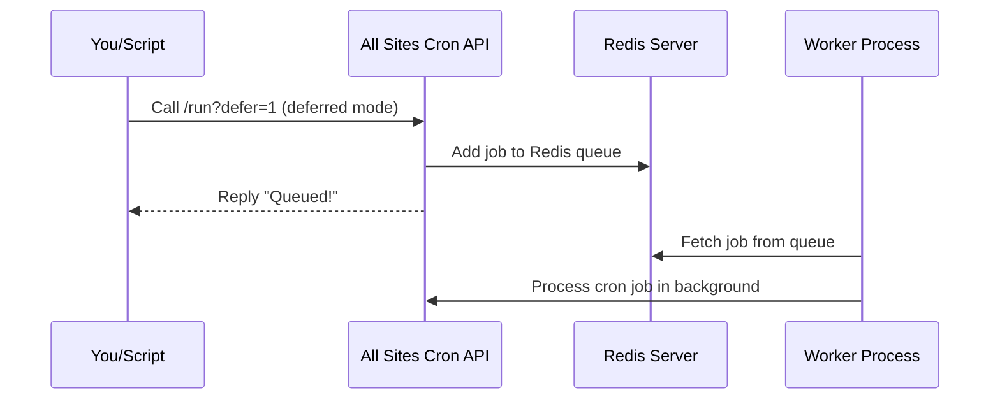

# Chapter 4: Redis Queue Integration

Welcome to Chapter 4!  
In [Chapter 3: Deferred & Background Processing](03_deferred___background_processing_.md), you learned how the **All Sites Cron** plugin can process network-wide cron jobs in the background, freeing up your scripts and browsers from waiting. But what if your network is **truly massive**—hundreds or thousands of sites—or you need bulletproof reliability? This is where **Redis Queue Integration** comes in.

---

## Why Use a Redis Queue? (Motivation & Use Case)

**Central Use Case:**  
*"I want to handle cron jobs for hundreds (or thousands) of WordPress sites quickly and safely, even if my site is busy, restarts, or runs on multiple servers. I need my 'trigger' to be instant, but the actual work to be processed reliably and not lost—even if the server gets interrupted."*

- **Fast triggers:** You click the button or schedule the task—the server replies FAST.
- **Reliable background processing:** Jobs are stored in Redis, so they're safe until fully processed.
- **Can scale up:** Add more worker processes if needed.
- **No jobs lost:** Even if your server restarts, jobs in the queue are not gone.

**Analogy:**  
Think of Redis like a "to do" bucket for dishwashing in a restaurant kitchen:
- Orders (jobs) go in the bucket right away.
- The servers (web requests) tell you “Your job is in the bucket!” and move on.
- Trusted dishwashers (worker processes) grab jobs from the bucket and do them, at any pace you want.

---

## What Is Redis Queue Integration?

It's an **optional, advanced feature** that turns the background job system into a **real queue** using [Redis](https://redis.io/)—a high-speed data store.

**When enabled:**
- All cron jobs are dropped into a Redis list (`all_sites_cron:jobs`), not processed directly in the web request.
- **Worker processes** (separate from website visitors) pick up jobs from this list and process them independently.

---

## Key Concepts

Let's break down what makes Redis Queuing different and why it's powerful:

### 1. **Instant Queuing, Not Processing**
- The web/API request *only* adds a job to Redis, replies fast, and leaves.
- No heavy work is done while the user waits!

### 2. **Reliable "To Do" List**
- Redis remembers jobs even if PHP or your server are restarted.
- Jobs are not lost unless you intentionally clear the queue.

### 3. **Separate Workers**
- Special scripts (“workers”) run separately (via cron job, service, etc.).
- They pick jobs from Redis and process them—at their own pace.
- Multiple workers = faster and safer processing.

### 4. **Automatic Fallback**
- If Redis isn't available, the plugin automatically falls back to the regular background method.
- **No extra setup** unless you want the full benefits of Redis!

---

## How to Use Redis Queue Integration

Let's see how easy it is to get started:

### 1. Trigger Cron Jobs (with Redis Queue)

Just trigger a deferred run as you did before:

```bash
curl "https://example.com/wp-json/all-sites-cron/v1/run?defer=1"
```

**Expected Output:**

```json
{
  "success": true,
  "status": "queued",
  "message": "Cron job queued to Redis for background processing",
  "mode": "redis"
}
```

*What happened?*  
- The job was added to the Redis "to do" list instantly.
- You're done—the work will run in the background!

### 2. Set Up a Worker Process

You now need something to actually **process the jobs** in the queue. The most common way: use your system's scheduler.

```bash
# (in your crontab, runs every minute)
* * * * * curl -X POST -s https://example.com/wp-json/all-sites-cron/v1/process-queue
```

This worker will keep checking Redis for queued jobs—and process them!

**What happens in the background?**
- The worker grabs the oldest job from Redis
- Triggers wp-cron on all sites as before
- Repeats every minute (or however you set it)

### 3. That's it!

**No additional configuration is needed if you're already using Redis** (e.g., via a popular WordPress Redis cache plugin).

If you want to customize things (like Redis host/port), see the "Options & Customization" section below.

---

## Step-by-Step: What Happens When You Trigger a Redis Queued Job?

Let’s break it down simply:



**Summary:**
- You trigger the job. API instantly queues it in Redis.
- Worker process later fetches and processes it.

---

## Monitoring & Checking the Queue

Need to see if there are jobs waiting in Redis?

```bash
# See how many jobs are in the queue
redis-cli LLEN all_sites_cron:jobs

# See (but don't remove) all jobs
redis-cli LRANGE all_sites_cron:jobs 0 -1
```

**If you see too many jobs stacking up:**  
- Your worker needs to run more often, or
- Your jobs are taking too long, or
- You need more/faster workers

---

## Worker Setup Options

Pick the one that fits your comfort level!

### Option 1: Simple Cron (Recommended for Beginners)

Edit your crontab:

```bash
* * * * * curl -X POST -s https://example.com/wp-json/all-sites-cron/v1/process-queue
```

Explained:
- Runs every minute.
- Looks for jobs, processes them if present.

### Option 2: WP-CLI Loop (Advanced, for those using WP-CLI)

A simple PHP worker script:

```php
// worker.php
while ( true ) {
    file_get_contents('https://example.com/wp-json/all-sites-cron/v1/process-queue');
    sleep(60);
}
```

This script checks every minute (can be run with `php worker.php` or `wp eval-file worker.php`).

---

## Configuration & Customization

You don’t *have* to change anything!  
But, if Redis is not on `localhost` or you need custom settings, add in your `wp-config.php`:

```php
// Custom Redis host/port (optional)
add_filter( 'all_sites_cron_redis_host', fn() => 'redis.example.com' );
add_filter( 'all_sites_cron_redis_port', fn() => 6379 );
```

To **disable** Redis queue (even if available):

```php
add_filter( 'all_sites_cron_use_redis_queue', '__return_false' );
```

---

## What If I Don't Have Redis?

No problem!  
- The plugin **automatically falls back** to the normal background processing mode.
- Everything works as described in [Deferred & Background Processing](03_deferred___background_processing_.md).

You **only** get Redis queuing if Redis is installed **and** working.

---

## Internal Implementation: Step-by-Step (For the Curious)

Here’s what happens under the hood:

1. You call `/run?defer=1`.
2. Plugin checks if Redis is available.
3. **If yes:** Pushes a small job record into a Redis list (`all_sites_cron:jobs`).
4. **If no:** Does the regular "background" method.
5. When your worker calls `/process-queue`:
   - It pops (removes) a job from the Redis list.
   - Runs the cron job for all sites (as described in [REST API Endpoint](01_rest_api_endpoint_.md)).
   - Returns success or error.

**Code Walkthrough (all-sites-cron.php):**

### Checking for Redis and Queuing a Job

```php
$use_redis = apply_filters( 'all_sites_cron_use_redis_queue', is_redis_available() );
if ( $use_redis ) {
    queue_to_redis( $now_gmt );
    // Respond instantly: job is queued
}
```

Explained:
- Checks if the Redis PHP extension and connection are OK.
- Uses Redis if available, otherwise automatically uses the regular method.

### The Redis Queue Worker

```php
function rest_process_queue() {
    // 1. Connect to Redis
    // 2. Pop a job off the queue
    // 3. Run cron on all sites
    // 4. Return a success message
}
```

Explained:
- Called by your scheduled worker (e.g., by system cron).
- Processes jobs one by one from Redis.

---

## Common Problems & Troubleshooting

- **"Jobs are not being processed"**  
  > Make sure your worker (cron job or script) is running!

- **"Jobs get stuck in Redis"**  
  > Increase worker frequency, or check for PHP/Redis errors.

- **"Redis not detected"**  
  > Ensure the PHP Redis extension is installed (`php -m | grep redis`).
  > Check your Redis server is running (`redis-cli ping`).

- **"Don’t want Redis at all?"**  
  >

---

Generated by [AI Codebase Knowledge Builder](https://github.com/The-Pocket/Tutorial-Codebase-Knowledge)