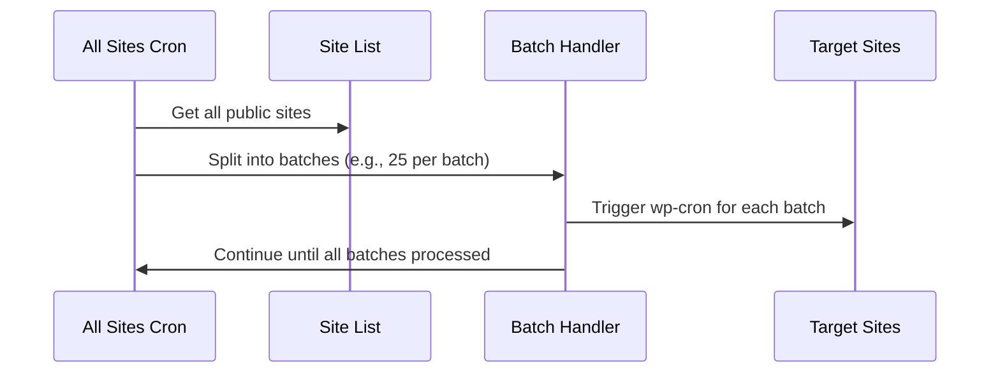

# Chapter 5: Batch Site Processing

Welcome to Chapter 5!  
In [Chapter 4: Redis Queue Integration](04_redis_queue_integration_.md), you learned how big networks use background queues for safe, scalable cron jobs. But what actually happens when the plugin starts working its way through all your sites? That’s where **Batch Site Processing** comes in.

---

## Why Batch Site Processing? (Motivation & Central Use Case)

Imagine:  
*"My WordPress multisite network has hundreds or even thousands of sites. I want to trigger wp-cron for all of them—but I *don’t* want to overload my server or run out of memory!"*

If the plugin tried to hit *every site* at once, the server could:
- **Crash** (too many requests at once)
- **Freeze** (memory fills up, site slows down)
- **Miss some sites** (PHP script timeouts)

**Batch Site Processing** solves this by splitting the big job into *smaller* chunks (“batches”), like working through a long to-do list a page at a time. This way, your server stays fast and reliable—even for huge networks!

---

## Key Concepts

Let’s break down this idea into simple pieces:

### 1. **Batch Size**

- Instead of launching all requests at once, the plugin sends cron jobs to *a few sites at a time*.
- By default, it processes **50 sites per batch**. (You can change this!)

> **Analogy:** If you have 1,000 letters to send, you don’t try to stuff them all into the mailbox at once. You put them in bundles and drop off each bundle, one after the other.

### 2. **Batch Looping**

- The plugin *loops* through all your sites, batch by batch, until it finishes.
- After each batch, it checks if there are more sites to process, and continues.

> **Analogy:** Like reading a book chapter by chapter, instead of all at once. You take breaks between chapters to stay fresh!

### 3. **Limits and Safety**

- You can set a **maximum total** number of sites for each run (default is 1000).
- If your network is bigger, it just runs up to your limit—no overloading!

### 4. **Customizable Settings**

- Batch size, total sites to process, and other limits can be changed using [filters](07_configuration_via_filters_.md).  
- This is great for tuning performance for *your* server.

---

## How Does Batch Site Processing Work? (Practical Usage)

You *don’t* have to do anything special—batching happens automatically in every run!

But you **can** change the batch size to fit your needs.

### Example: Setting Batch Size

Add to your `wp-config.php` or custom plugin:

```php
add_filter( 'all_sites_cron_batch_size', fn() => 25 );
```

This will process **25 sites per batch** instead of 50.  
*(Smaller batch = lower memory and server load. Larger batch = faster overall, but needs a stronger server.)*

### Example: Triggering a Cron Run

Just trigger the endpoint as usual (see [REST API Endpoint](01_rest_api_endpoint_.md)):

```bash
curl "https://example.com/wp-json/all-sites-cron/v1/run?defer=1"
```

If your network has 120 sites and batch size is 25, the plugin will:

- Process batch 1 (sites 1–25)
- Batch 2 (26–50)
- Batch 3 (51–75)
- Batch 4 (76–100)
- Batch 5 (101–120)

Each batch gets its own attention.  
If one batch has a slow site, others aren’t held back!

---

## What Happens Behind the Scenes?

Let’s walk through step-by-step with a simple diagram.



**Plain English:**
- The plugin gets all the sites in your network.
- Breaks the list into small batches—like cutting a cake into slices.
- Processes each batch (“trigger cron jobs”) one at a time.
- Keeps going until all slices are done!

---

## Simple Code Walkthrough

Here’s a friendly look at how batch processing is coded.

**Step 1: Pull Network Sites in Batches**

```php
$batch_size = apply_filters( 'all_sites_cron_batch_size', 50 );
$offset = 0;

do {
    $sites = get_sites([
        'number' => $batch_size,
        'offset' => $offset,
        // ...other filters...
    ]);
    // ...process each batch...
    $offset += $batch_size;
} while ( count($sites) === $batch_size );
```

**Explanation:**  
- Gets a chunk (“batch”) of sites.
- Processes each batch.
- Moves the offset forward, repeats until done.

---

**Step 2: Process Each Site in a Batch (“Fire and Forget”)**

```php
foreach ( $sites as $site ) {
    $cron_url = $site_url . '/wp-cron.php';
    wp_remote_post( $cron_url, [ 'timeout' => 0.01, 'blocking' => false ] );
}
```

**Explanation:**  
- For every site in the batch, the plugin “pings” their cron URL.
- “Non-blocking” means it doesn’t wait for each one—so it’s super fast!

---

**Step 3: Stop at the Total Limit (Optional)**

```php
if ( $total_count >= $max_sites ) {
    break;
}
```

**Explanation:**  
- If you set a maximum number of sites to process (e.g. 1000), the job stops there.
- This keeps big networks safe!

---

## Tuning for Your Network (Optional Advanced Step!)

You can use filters to customize batch size and other limits.  
See full options in [Chapter 7: Configuration via Filters](07_configuration_via_filters_.md).

Example for big networks:

```php
add_filter( 'all_sites_cron_batch_size', fn() => 20 );
add_filter( 'all_sites_cron_number_of_sites', fn() => 2000 );
```

---

## Why Is Batch Processing Important?

- **Avoids server overload:** No memory crashes, even with thousands of sites.
- **Reliable and robust:** Each batch is quick, so if one group fails, others keep going.
- **Flexible:** Works perfectly for small *and* large multisite networks.

> **Analogy Time:**  
> Picture a chef making 1000 pancakes. Instead of trying to flip them all at once, they cook them in groups—a batch at a time. The kitchen stays calm, and nothing burns!

---

## Internal Files and Where to Look

All this logic lives in:

- `all-sites-cron.php`
    - Function: `run_cron_on_all_sites()`

Look for these lines in the source code if you’re curious:

```php
$batch_size = (int) apply_filters( 'all_sites_cron_batch_size', 50 );
$sites = get_sites([ ... ]);
// Process sites in batches!
```

---

## Wrapping Up

**You now understand:**
- Why batch processing is vital for stable multisite cron jobs.
- How the plugin safely splits the job into small, manageable chunks.
- How you can customize batch size and limits for your own network.

Ready to learn how the plugin keeps these jobs from overlapping or running too often?  
Continue with: [Locking and Rate Limiting](06_locking_and_rate_limiting_.md)

---

---

Generated by [AI Codebase Knowledge Builder](https://github.com/The-Pocket/Tutorial-Codebase-Knowledge)