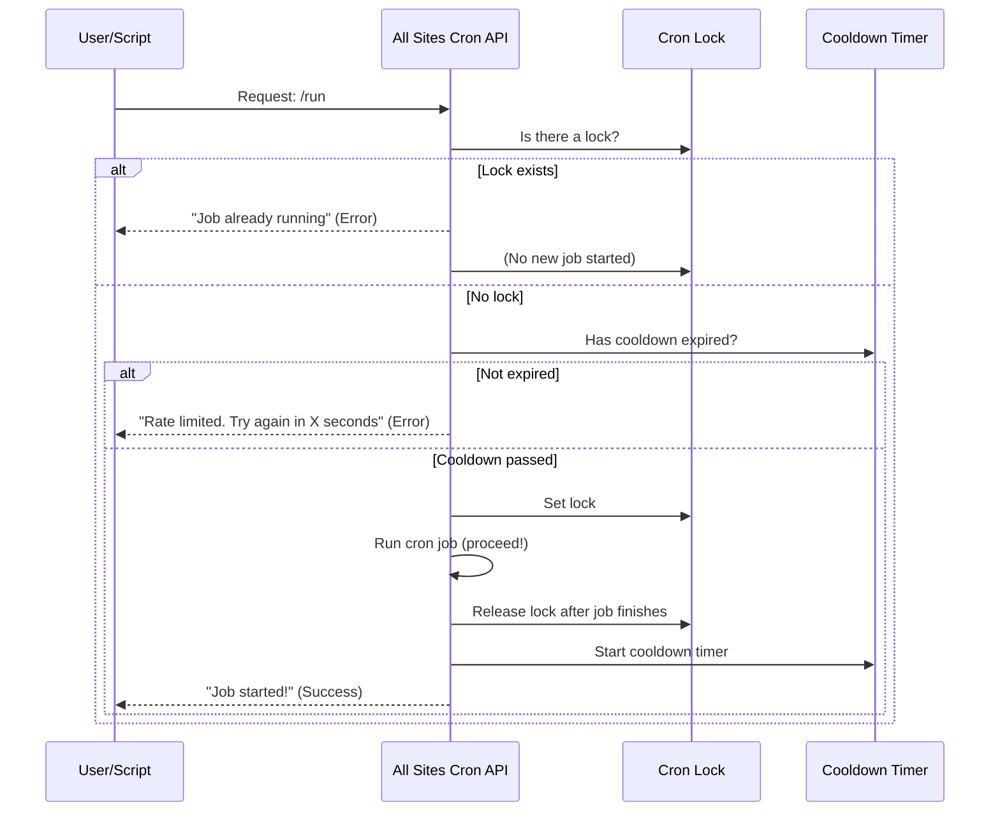

# Chapter 6: Locking and Rate Limiting

Welcome to Chapter 6!  
In [Chapter 5: Batch Site Processing](05_batch_site_processing_.md), you learned how **All Sites Cron** safely processes sites in manageable batches so your server stays reliable. But what happens if someone (or something) tries to trigger the cron job **too often, or too quickly**? What if two jobs launch at the same time?

This chapter explains **Locking and Rate Limiting**—two simple but powerful tools that keep your network safe from overload and duplicate work.

---

## Why Locking and Rate Limiting? (Central Use Case)

**Use Case:**  
*"I want to run wp-cron on all multisite network sites, but I need to make sure:  
- Only one job runs at a time (no overlapping!),  
- The job doesn’t run too frequently and overload my server."*

Without these protections, you might:
- Accidentally start two jobs at once (causing chaos!),
- Spawn jobs every second (overloading sites),
- Create duplicate work, making diagnostics harder.

**Locking** and **Rate Limiting** are like traffic lights for your cron highway:
- **Locking:** Only one car (job) goes at a time. No side-by-side racing allowed!
- **Rate Limiting:** You must wait for a *cooldown* between green lights. No speeding.

---

## Key Concepts

Let’s break both ideas into simple parts:

### 1. **Locking: Only One Job at a Time**

- Before a job runs, it checks for a *lock* (like a “job in progress” flag).
- If the lock exists, no new job can start—everyone else must wait.
- The system sets the lock as soon as a job starts, and **removes** it when done.

> **Analogy:**  
> Imagine a public bathroom with a key. Only one person can hold the key at a time. Others must wait until it’s back.

### 2. **Rate Limiting: Cooldown Timer**

- After a job finishes, a *cooldown* timer begins (default: 60 seconds).
- If you try to start a new job too soon, you get a polite "wait X seconds" message.
- Prevents a stampede of jobs that would overload the network!

> **Analogy:**  
> Like a microwave that won’t start again until it’s cooled down—no button mashing allowed!

---

## How Does This Work In Practice?

You don’t need to do anything special—**All Sites Cron** handles this automatically every time you call the cron endpoint.

### Example 1: Calling the Cron Endpoint Normally

```bash
curl "https://example.com/wp-json/all-sites-cron/v1/run"
```

**If no job is running** and you haven’t hit the rate limit:
- The cron job starts!

**If a job is already running** (“locked”):
- You get a message like:
  ```
  {
    "message": "Another cron process is currently running. Please try again later."
  }
  ```

**If you call the endpoint again too soon** (“rate limited”):
- You get:
  ```json
  {
    "error": "rate_limited",
    "message": "Rate limited. Try again in 37 seconds.",
    "retry_after": 37
  }
  ```

### Example 2: Using GitHub Actions Plain Output

Add `?ga=1` for simple output:

```bash
curl "https://example.com/wp-json/all-sites-cron/v1/run?ga=1"
```

If locked or rate limited, you see:

```
::error::Another cron process is currently running. Please try again later.
```
or
```
::error::Rate limited. Try again in 37 seconds.
```

---

## How To Change The Cooldown (Rate Limit)

You *can* customize the cooldown with a simple filter in your WordPress setup.

```php
add_filter( 'all_sites_cron_rate_limit_seconds', function( $seconds ) {
    return 120; // 2 minutes cooldown between jobs
});
```

> **See more about filters in [Configuration via Filters](07_configuration_via_filters_.md).**

---

## What Happens Behind the Scenes? (Step-by-Step)

Let’s look at how locking and rate limiting work in a typical cron job request.



**Plain English:**
- The plugin checks if another job is running (`lock`). If yes, it blocks you.
- If not running, it checks if you’re within the cooldown (`rate limit`). If yes, it blocks you with a “wait” message.
- If both checks “pass”, it sets the lock and runs the job.
- When done, it releases the lock and starts the cooldown.

---

## Internal Implementation (How the Code Works)

All the magic lives in [`all-sites-cron.php`](all-sites-cron.php).  
Let’s peek at the core concepts!

### Step 1: Try to Acquire the Lock

```php
function acquire_lock() {
    // Check for an existing lock
    $existing_lock = get_site_transient( 'all_sites_cron_lock' );
    if ( $existing_lock ) {
        // If lock is recent, block new job!
        return new \WP_Error('locked', 'Another cron process is currently running.');
    }
    // Set the lock for this job
    set_site_transient( 'all_sites_cron_lock', time(), 300 ); // lock lasts up to 5 minutes
    return true;
}
```
**Explanation:**  
- If someone else holds the lock, you can’t start your job.
- Otherwise, you claim the lock and begin.

### Step 2: Release the Lock After You’re Done

```php
function release_lock() {
    delete_site_transient( 'all_sites_cron_lock' );
}
```
**Explanation:**  
- Unlocks the system so the *next* job can start.

### Step 3: Check the Rate Limit

```php
function check_rate_limit() {
    $cooldown = apply_filters( 'all_sites_cron_rate_limit_seconds', 60 );
    $last_run = get_site_transient( 'all_sites_cron_last_run_ts' );
    if ( $last_run && ( time() - $last_run ) < $cooldown ) {
        // Job ran too recently!
        return [
            'error' => 'rate_limited',
            'message' => 'Rate limited. Try again in X seconds.',
            'retry_after' => $cooldown - (time() - $last_run),
        ];
    }
    return true;
}
```
**Explanation:**  
- Checks when the last job ran.
- Blocks repeated jobs until the cooldown expires.

---

## Analogy Time!

- **Locking:** Like a shared bathroom with a “Occupied” sign—only one person at a time!
- **Rate Limiting:** Like waiting for cookies to cool before you can bake the next batch.

---

## Customizing & Troubleshooting

**To make jobs run less often:**
- Increase the cooldown period in your site’s code (see the filter example above).

**To fix stuck locks:**
- If jobs get "stuck" with a persistent lock, simply deactivate/re-activate the plugin.

**For debugging:**
- Locked or rate-limited responses always get a clear message (JSON or plain text for GitHub Actions).

---

## Wrapping Up

In this chapter, you learned:
- The purpose of **locking** and **rate limiting**: preventing duplicate jobs and server overload
- How both tools work together automatically behind the scenes
- How to recognize and customize their behavior
- Friendly analogies to make the concepts familiar!

Ready to take more control? In the next chapter, you’ll learn how to adjust these (and other) settings with WordPress **filters:**  
→ [Configuration via Filters](07_configuration_via_filters_.md)

---

**Onward to customization!**  
Continue with: [Configuration via Filters](07_configuration_via_filters_.md)

---

Generated by [AI Codebase Knowledge Builder](https://github.com/The-Pocket/Tutorial-Codebase-Knowledge)