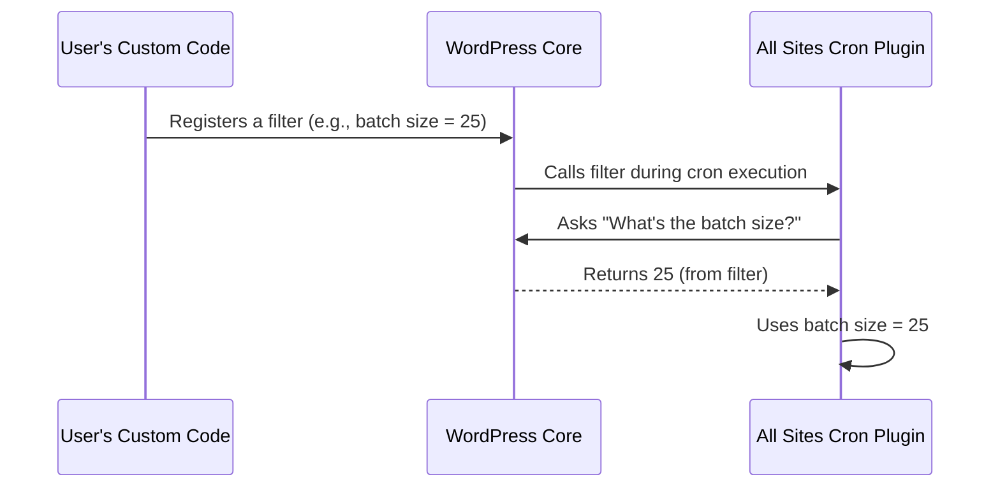

# Chapter 7: Configuration via Filters

In [Chapter 6: Locking and Rate Limiting](06_locking_and_rate_limiting_.md), you learned how All Sites Cron protects your multisite network from overlapping jobs and overloading.  
But what if your network is different from everyone else’s?  
Maybe you want jobs to run **less** often, process more sites at once, or adjust how the plugin talks to Redis.

Welcome to the power of **Configuration via Filters**! This chapter will teach you how to **customize** All Sites Cron’s behavior—without ever touching its internal code.

---

## Why Configuration via Filters? (Motivation & Use Case)

### Central Use Case:

> *“I run a large multisite network and want to process 25 sites at a time (instead of 50), increase the rate-limit to 3 minutes, and tweak how the plugin talks to Redis. Is there a way to do this safely, even after updates?”*

**Yes!** Filters let you tune All Sites Cron for your unique needs—just by adding a few lines of code **outside** the plugin itself.

---

## What Are Filters? (Beginner-Friendly Concept)

- **WordPress filters** are like "magic knobs" baked into the system.
- You can twist these knobs from anywhere: your own plugin, your `wp-config.php`, or even a custom code snippet.
- **No need to edit All Sites Cron’s own code!**  
  (Which means: You can update the plugin safely, and your settings are unaffected.)

> **Analogy:**  
> Imagine a fancy coffee machine. Normally, you just press “Start.” But you can also attach your own dials—change brew time, temperature, or cup size—without opening the machine!

---

## Key Configuration "Knobs" You Can Adjust

The most common filters in All Sites Cron let you control:

1. **Rate Limiting:**  
   How long to wait between jobs.

2. **Batch Size:**  
   How many sites are processed at once.

3. **Total Sites:**  
   Maximum sites processed per run.

4. **Timeout:**  
   How long to wait for each site’s cron ping.

5. **Redis Settings:**  
   How the plugin connects to Redis (host, port, etc.).

Let’s walk through each, step by step.

---

### 1. Change Rate Limiting (How Often Cron Runs)

**Want the cron to run at most once every 3 minutes (180 seconds)?**

```php
add_filter( 'all_sites_cron_rate_limit_seconds', function( $seconds ) {
    return 180; // 3 minutes
});
```

*Copy this into your own plugin, theme’s `functions.php`, or use a snippets plugin or mu-plugin!*

**What it does:**  
> Cron jobs won’t start if the last run was less than 180 seconds ago.

---

### 2. Change Batch Size (Sites Per Batch)

**Want batch jobs to be smaller (e.g., 20 at a time)?**

```php
add_filter( 'all_sites_cron_batch_size', function() {
    return 20;
});
```

**What it does:**  
> Each group of cron “pings” only processes 20 sites before the next batch starts. Less server load per batch!

---

### 3. Change Max Sites Per Run

**Limit runs to 500 sites total?**

```php
add_filter( 'all_sites_cron_number_of_sites', function() {
    return 500;
});
```

**What it does:**  
> Even on huge networks, only 500 sites are processed per job. Safer for big clusters!

---

### 4. Change Timeout for Cron Requests

**Want each cron ping to have a longer timeout?**

```php
add_filter( 'all_sites_cron_request_timeout', function() {
    return 0.05; // 50 milliseconds per ping
});
```

_Default is 0.01 (10 milliseconds); adjust as needed!_

---

### 5. Configure Redis Connection (Advanced)

**Want the plugin to use a different Redis host?**

```php
add_filter( 'all_sites_cron_redis_host', function() {
    return 'redis.example.com';
});
```

**Or, set a custom port:**

```php
add_filter( 'all_sites_cron_redis_port', function() {
    return 6380;
});
```

**Or, change the queue key string (for advanced setups):**

```php
add_filter( 'all_sites_cron_redis_queue_key', function( $key ) {
    return 'my_custom_jobs_queue';
});
```

---

## How to Use Filters in Practice

**Step 1:**  
Paste the filter code into any of the following:
- A custom plugin (recommended for maintainability)
- Your theme’s `functions.php` file
- A [Must-Use Plugin ("mu-plugin")](https://developer.wordpress.org/plugins/mu-plugins/)

**Step 2:**  
Save and upload (if needed).  
You’re done—the next cron job will follow your rule!

> **No plugin edits. No hacks. Always survives updates!**

*Tip: You can stack multiple filters. Each runs independently!*

---

## Input & Output Example

### Example: Change Two Settings for Large Networks

**Goal:**  
- Run jobs no more than once every 5 minutes
- Process 25 sites per batch

**Code:**

```php
add_filter( 'all_sites_cron_rate_limit_seconds', fn() => 300 ); // 300s == 5 min
add_filter( 'all_sites_cron_batch_size', fn() => 25 );
```

**Result:**  
- API will block jobs less than 5 minutes apart (“Rate limited” error)
- Each batch during a run touches only 25 sites at a time

---

## How Does This Work Internally? (Behind the Scenes)

Let’s follow what happens **when you change a filter** and the plugin runs.



**Plain English:**  
- You set or change a filter value in your code.
- When All Sites Cron runs, it **asks WordPress for that value** (calls the filter).
- WordPress “pipes in” your custom setting.
- The plugin uses your new value—no matter the default!

---

## Under the Hood: Code Walkthrough

Most filters in All Sites Cron look like this inside `all-sites-cron.php`:

```php
$batch_size = apply_filters( 'all_sites_cron_batch_size', 50 );
```
**Explanation:**  
- The plugin asks WordPress: “Any filter set for `all_sites_cron_batch_size`?”
- If yes, WordPress provides **your number**.
- If no, it uses the *default* (`50` here).

**Changing a value:**

```php
add_filter( 'all_sites_cron_batch_size', function() {
    return 25;
});
```
**Your code “answers” the plugin’s request for this value!**

---

## Analogy Time!

- **Filters are like remotes:**  
  You push a button (“Set batch size to 25!”), and the plugin responds instantly.
- **No waiting for the manufacturer to ship you new coffee machine firmware—just set your settings and go!**

---

## Troubleshooting Tips

- **Filters "stack"**—if multiple places define the same filter, the *last one* (by load order) wins.
- If a filter doesn't seem to apply, make sure it's in a file that loads **before** plugins run (preferably in a mu-plugin or early in your theme).
- To check what settings are active, look for output in the plugin’s log or test with small values.

---

## Wrapping Up

Congratulations! Now you know how to twist All Sites Cron’s “knobs” to **fit your network**, using safe and simple WordPress filters:

- **Batch size, rate limiting, Redis, timeout, and more—adjusted without hacking the plugin.**
- These changes will always survive updates and are easy to share or document.

Ready to see how the plugin keeps itself up-to-date and safe? Continue to:  
[Updater Integration](08_updater_integration_.md)

---

---

Generated by [AI Codebase Knowledge Builder](https://github.com/The-Pocket/Tutorial-Codebase-Knowledge)