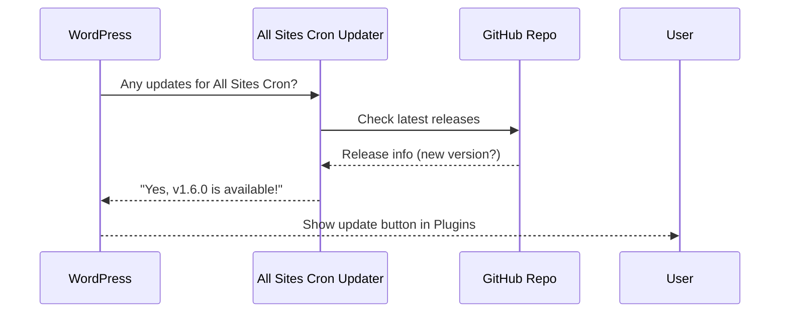

# Chapter 8: Updater Integration

In [Chapter 7: Configuration via Filters](07_configuration_via_filters_.md), you learned how to fine-tune All Sites Cron’s settings for your unique network. Now let’s see how the plugin keeps **itself** up-to-date without you having to lift a finger!

---

## Why Updater Integration? (Motivation & Use Case)

**Central Use Case:**  
*“I want to make sure my All Sites Cron plugin always has the latest features and bug fixes, but I don’t want to manually check the GitHub page or handle uploads with every new release.”*

This is where **Updater Integration** shines:

- It checks GitHub for updates automatically.
- It lets you update the plugin securely right from your WordPress dashboard, just like plugins from wordpress.org.
- No extra plugins or ongoing manual work needed!

---

## Key Concepts

Let’s break Updater Integration into three simple pieces:

### 1. **Automatic Update Checks**
The plugin connects to its GitHub repository and looks for new releases. No need to visit GitHub or download zips.

### 2. **Secure Installation from GitHub**
When a new version is found, it’s installed **the same way as normal plugins**, but fetched directly from the official source.

### 3. **Easy, Native Experience**
You’ll see update notifications for All Sites Cron in your dashboard’s “Plugins” page. One click = update complete.

> **Analogy:**  
> Think of it as self-refreshing coffee! Instead of running to the shop when supplies run low, your machine orders new beans and refills itself.

---

## How Does Updater Integration Work for You?

### Typical Workflow

1. **You install All Sites Cron (once),** either by download/upload or from the GitHub release.
2. **Later, a new version is released** on GitHub by the author.
3. **All Sites Cron automatically checks for updates** (every 12–24 hours), just like any other plugin.
4. **You see an update notice** right in your Plugins list:

     
   *All Sites Cron has a new version available. Click Update Now!*

5. **Click “Update now”,** and the latest version is downloaded and installed securely.
6. **Done!** You’re on the latest and greatest—no manual download/upload required.

---

## Example: What You’ll See in Your Dashboard

When there’s a new version, your Plugins screen will show:

```
There is a new version of All Sites Cron available. View version details or update now.
```

Just click **Update now**—it works exactly like built-in plugin updates!

---

## Internal Implementation (What’s Under the Hood?)

Curious how the magic works? The plugin uses a helper known as a **GitHub Updater** library.

**Step-by-step process:**



**Plain English:**  
- WordPress asks the plugin’s updater module whether updates are available.
- The updater checks GitHub for the newest release.
- If there’s a new version, your dashboard shows an update button.
- Clicking it downloads and installs the new version securely.

---

## Tiny Peek at the Code

The updater integration is set up right in `all-sites-cron.php`:

```php
$all_sites_cron_updater = GitHub_Plugin_Updater::create_with_assets(
    'https://github.com/soderlind/all-sites-cron', // GitHub repo URL
    ALL_SITES_CRON_FILE,                           // Plugin file path
    'all-sites-cron',                              // Plugin slug
    '/all-sites-cron\.zip/',                       // Release asset pattern
    'main'                                         // Branch name
);
```

**What does this do?**

- Sets up the updater to watch the correct GitHub URL and branch.
- Ensures when a new zip (release) is published, the plugin can fetch it.

The actual update engine lives in [`class-github-plugin-updater.php`](class-github-plugin-updater.php), but you never need to touch this.

---

## Is This Safe and Reliable?

Yes! This system:

- **Verifies** the update comes only from the official GitHub repository.
- **Runs only if you approve each update** (just like official plugins).
- **Never overwrites settings or customizations** outside the plugin.

> **Note:**  
> If you ever want to stay on a fixed version, just don’t click "Update Now". Updater Integration never forces updates automatically.

---

## No Extra Setup (Usually)

As long as you installed All Sites Cron like any other plugin, updater integration works out of the box.  
No extra plugins, settings, or API keys needed!

If you ever need to troubleshoot, just check your Plugins screen or see the developer’s [GitHub page](https://github.com/soderlind/all-sites-cron) for release notes.

---

## Analogy: The Plugin That Shops for Itself

- **Without updater integration:**  
  You have to check the bakery every morning to see if new bread (features) is available.
- **With updater integration:**  
  The bakery delivers bread automatically to your house—and leaves a doorbell note when it arrives!

---

## Wrapping Up

With **Updater Integration**, All Sites Cron stays modern, safe, and feature-rich with zero effort. Automatic update checks and one-click installs mean you can focus on running your network—not chasing plugin zips.

You now know:

- Why the updater exists, and the problem it solves
- How it works automatically and safely in the background
- What you’ll see when an update is ready

**Ready to learn how the plugin cleans up after itself when deactivating or removing?**  
Continue to [Activation, Deactivation, and Uninstall Cleanup](09_activation__deactivation__and_uninstall_cleanup_.md)

---

---

Generated by [AI Codebase Knowledge Builder](https://github.com/The-Pocket/Tutorial-Codebase-Knowledge)