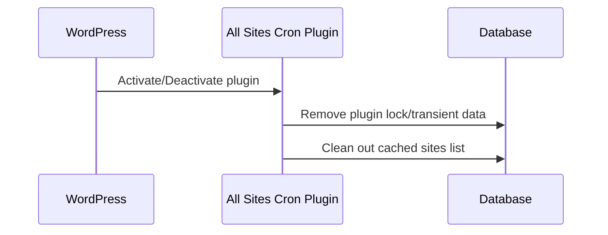
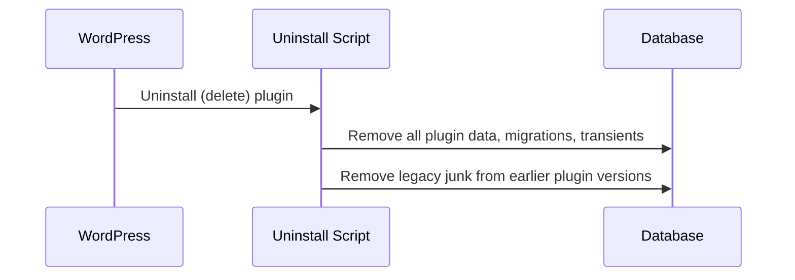

# Chapter 9: Activation, Deactivation, and Uninstall Cleanup

In the last chapter, [Updater Integration](08_updater_integration_.md), you saw how **All Sites Cron** can update itself safely and automatically.

Now, let's focus on one of the most important areas of WordPress plugin design:  
**Housekeeping routines** that keep your database clean and your network tidy!

---

## Motivation: Why Do We Need Activation, Deactivation, and Uninstall Cleanup?

**Central use case:**  
*"I want to install or remove the All Sites Cron plugin without worrying about leftover data, broken transients, or junk in my WordPress network. How can I make sure the plugin cleans up after itself—no mess, no fuss?"*

When plugins are active, they may:
- Create settings and temporary data (called *transients*, used for caching and coordination).
- Store locks or flags that control how jobs run.
- Create migration markers or legacy data.

When you **activate**, **deactivate**, or **uninstall** a plugin, it should:
- Set up any needed data.
- Remove all temporary and plugin-related data so your database stays clean.

**Why does this matter?**
> Imagine renting out a workspace. You don't want the last person leaving behind trash, broken furniture, or leftover junk. You want a clean room, ready for whatever's next!

---

## Key Concepts

We'll look at three core routines:

1. **Activation**: Runs ONCE when the plugin is first enabled.
2. **Deactivation**: Runs when you disable (but do not delete) the plugin.
3. **Uninstall Cleanup**: Runs ONLY when you delete the plugin—this is the "deep clean".

Let's break each routine down, beginner-style.

---

### 1. Activation

**What happens on activation?**
- The plugin removes any old "locks" or temporary flags that might block your cron jobs.
- It wipes out stale transients and any records left from previous use.

You do **NOT** need to do anything extra—just activate as usual!

**Example (Activating the Plugin):**

When you click "Activate" in WordPress, this runs:

```php
function activation() {
    // Remove any lock or history from old runs
    delete_site_transient( 'all_sites_cron_lock' );
    delete_site_transient( 'all_sites_cron_last_run_ts' );
    // Remove any cached sites list
    delete_site_transient( 'all_sites_cron_sites' );
}
```
> This ensures your cron jobs aren't stuck or blocked by leftovers from a previous install.

**Where does it run?**  
It's hooked with:

```php
register_activation_hook( ALL_SITES_CRON_FILE, __NAMESPACE__ . '\\activation' );
```
*(The plugin does this for you!)*

---

### 2. Deactivation

**What happens when you deactivate (but don't delete) the plugin?**
- All plugin temporary data is cleaned up (same as activation).
- Your settings and site are ready for future reactivation, with no leftovers.

**Example (Deactivating the Plugin):**

```php
function deactivation() {
    // Remove all plugin transients
    delete_site_transient( 'all_sites_cron_lock' );
    delete_site_transient( 'all_sites_cron_last_run_ts' );
    delete_site_transient( 'all_sites_cron_sites' );
}
```
> This means if you ever turn the plugin off then on again, it's like a clean slate.

**Where is it hooked?**

```php
register_deactivation_hook( ALL_SITES_CRON_FILE, __NAMESPACE__ . '\\deactivation' );
```

---

### 3. Uninstall Cleanup ("Full Clean")

**What happens when you uninstall (delete) the plugin entirely?**

- Every trace of the plugin is removed—including legacy data, temp settings, migration flags, and *old names* (from earlier plugin versions or renames).
- Runs deeper queries to clean up historic junk!

**Example (Uninstalling the Plugin):**

WordPress runs `uninstall.php`, which does:

```php
function all_sites_cron_uninstall_cleanup() {
    // Clean out all transients and migration flags
    delete_site_transient( 'all_sites_cron_lock' );
    delete_site_transient( 'all_sites_cron_last_run_ts' );
    delete_site_transient( 'all_sites_cron_sites' );
    delete_site_option( 'all_sites_cron_migrated_legacy_transients' );

    // Remove legacy and new transients, including timeouts
    // (for all previous plugin versions and naming!)
    // ...runs a few simple database queries to find and delete these options...
}
```

*No manual steps! Just click "Delete" in the Plugins screen and WordPress triggers `uninstall.php` for a thorough clean.*

---

## How These Routines Work (Step-by-Step)

Let's see what happens under the hood if you **activate, deactivate, or uninstall** All Sites Cron.

### Activation & Deactivation



**Plain English:**  
- When you activate or deactivate, the plugin erases old temporary data so every run starts clean.

### Uninstall (Full Cleanup)



**No leftovers—and your database is clean for good!**

---

## Internal Implementation: Code Walkthrough

For those curious, here are the **key files and code snippets** (always shortened for beginners):

1. **Plugin file:**  
   [`all-sites-cron.php`](all-sites-cron.php)
2. **Uninstall script:**  
   [`uninstall.php`](uninstall.php)

**Activation and Deactivation are simple—just delete a few transients:**

```php
delete_site_transient( 'all_sites_cron_lock' );
delete_site_transient( 'all_sites_cron_last_run_ts' );
delete_site_transient( 'all_sites_cron_sites' );
```

**Uninstall also deletes migration flags and does a pattern search for legacy names:**

```php
delete_site_option( 'all_sites_cron_migrated_legacy_transients' );

// For all old transients with "dss_cron" or "all_sites_cron" in their name:
$patterns = [ /* several patterns... */ ];
foreach ( $patterns as $pattern ) {
    // Run simple SQL to find and delete each option!
}
```
*(No need to read or modify! It works automatically.)*

---

## What If I Used an Old Version or Migrated From DSS Cron?

No worries.  
- When activated, the plugin runs a one-time migration that **cleans up** old data automatically.
- When uninstalled, it searches for old transient patterns (like "dss_cron_*") and removes them, too!

**No old junk, no version conflicts. Everything is tidied up!**

---

## Analogy Time!

- **Activation/Deactivation:** Like doing a quick sweep and clearing the whiteboard when you open or close a meeting room.
- **Uninstall Cleanup:** Like hiring a cleaning crew to wipe down every surface and remove anything not nailed down—ready for the next tenant!

---

## Wrapping Up

You now know:
- How All Sites Cron keeps your WordPress multisite network CLEAN—never leaving behind junk data.
- What happens when you activate, deactivate, or fully uninstall the plugin.
- Why these routines matter for a healthy, speedy, and safe WordPress installation.

The plugin does all this **behind the scenes** so you never have to think about it!

Next, let's look at backward compatibility and how All Sites Cron works with older sites and plugins:  
→ [Legacy DSS Cron Compatibility](10_legacy_dss_cron_compatibility_.md)

---

---

Generated by [AI Codebase Knowledge Builder](https://github.com/The-Pocket/Tutorial-Codebase-Knowledge)