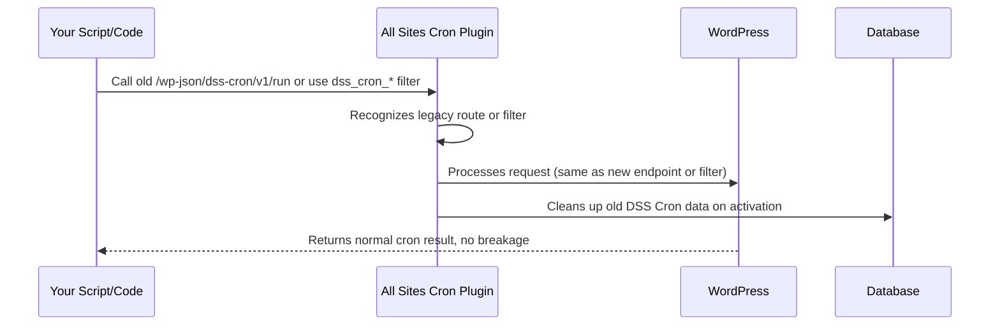

# Chapter 10: Legacy DSS Cron Compatibility

In [Chapter 9: Activation, Deactivation, and Uninstall Cleanup](09_activation__deactivation__and_uninstall_cleanup_.md), you learned how the plugin keeps your network tidy by cleaning up after itself.

But what happens if you’ve been using the old **DSS Cron** plugin—and you (or your scripts) still rely on its old routes, filters, or leftover data?  
This chapter will explain **Legacy DSS Cron Compatibility**: how "All Sites Cron" keeps everything working, even if you’re upgrading from DSS Cron, and how it helps you migrate safely with no headaches.

---

## Motivation: Why Care About Legacy Compatibility?

**Central Use Case:**
> *“I’ve upgraded from DSS Cron to All Sites Cron—but my monitoring tools, scripts, or code expect the *old* `/wp-json/dss-cron/v1/run` endpoint or filters like `dss_cron_rate_limit_seconds`. I want everything to keep working smoothly, with NO breaking changes, while I migrate my tools and code at my own pace.”*

All Sites Cron understands that not everyone can update all their systems at once. **Legacy DSS Cron Compatibility** means you can safely switch to the new plugin **without breaking anything**—and transition gradually.

---

## Key Concepts

Let’s break compatibility down to three beginner-friendly ideas:

### 1. **Legacy REST Endpoint Still Works**

- The old DSS Cron REST API endpoint (`/wp-json/dss-cron/v1/run`) is still supported as a **deprecated alias**.
- Your old scripts won’t break—they can still call the same URL (for now!).

### 2. **Old Filter Names Still Supported**

- All key DSS Cron filter hooks, like `dss_cron_rate_limit_seconds`, are still **active**.
- Your old code that changes rate limits, batch size, etc., will keep working.
- You are encouraged to **migrate to the new filter names** (like `all_sites_cron_rate_limit_seconds`) for the future.

### 3. **Legacy Data & Transient Cleanup**

- When you first install/activate All Sites Cron, it automatically **cleans up old DSS Cron data** (transients and temp options).
- This avoids conflicts or double-executions as you switch plugins.

> **Analogy:**  
> Imagine moving from an old TV remote to a new, fancy one. For a while, **both** remotes work—even if some buttons are renamed—until you're ready to hide the old one for good!

---

## How to Use Legacy DSS Cron Compatibility

You *don’t* have to do anything special—All Sites Cron does all this so your old code, scripts, and tools keep working.

### Example 1: Your Automation Script Calls the Old DSS Cron Route

**Old script:**
```bash
curl "https://example.com/wp-json/dss-cron/v1/run"
```

**Result:**  
- Still works!  
- Triggers cron across your network, same as `/wp-json/all-sites-cron/v1/run`.

> You don’t *have* to update your tools right away.

---

### Example 2: Your Custom Code Uses the Old Filter Names

**Old code (in mu-plugin or theme):**
```php
add_filter( 'dss_cron_rate_limit_seconds', function() {
    return 120;
});
```
**Result:**  
- Still sets the rate limit!  
- All Sites Cron recognizes and uses this value (but new code should use the updated filter name).

---

### Example 3: Old DSS Cron Transients in the Database

When you activate All Sites Cron, it quietly cleans up these **old database entries** (to avoid double runs or debris):

- `_site_transient_dss_cron_*`
- `_transient_dss_cron_*`
- ...and related timeout/cached values.

**No manual cleanup needed.**

---

## What Happens Internally? (Step by Step)

Let’s see how All Sites Cron ensures legacy compatibility behind the scenes.



**Plain English:**  
- The plugin listens on both the *new* and *old* REST API endpoints.
- Filter lookups check both new and legacy names.
- On first load, it deletes any old DSS Cron temp data from the database.

---

## Internal Implementation: Walkthrough & Code

Let’s demystify a few key pieces—don’t worry, these are intentionally simple!

### 1. **Supporting Both Endpoints**

**REST route registration (in `all-sites-cron.php`):**
```php
register_rest_route( 'all-sites-cron/v1', '/run', $route_config );

// Also register legacy DSS Cron endpoint:
register_rest_route( 'dss-cron/v1', '/run', $route_config );
```
*Both URLs call the **same handler** under the hood!*

---

### 2. **Supporting Both Filter Names**

**Getting a setting, supporting both old and new (internal utility):**
```php
function get_filter( $new, $legacy, $default ) {
    return apply_filters( $new, apply_filters( $legacy, $default ) );
}
```
- The plugin **checks the new filter first** (`all_sites_cron_*`).  
- If not set, it falls back to the old DSS Cron one.

---

### 3. **Legacy Data Cleanup on Activation**

**One-time migration runs as soon as you load the plugin:**
```php
function maybe_migrate_legacy_transients() {
    // Find all database entries starting with _site_transient_dss_cron_ or _transient_dss_cron_
    // For each one:
    delete_option( $option_name );
    // Flag as done so it won't run again
}
```
- This keeps your database clean.
- No risk of double triggers or leftover junk.

---

## Migration Tips

- **New installs:** Use only the "all-sites-cron" URL and filters.
- **Old scripts or code:** Keep running! Migrate to new endpoints/filters at your own pace.
- **Cleaning Up:** Once you’ve updated all your tools, you can remove DSS Cron-specific filters and switch to new ones.
- **Future-Proofing:** Old filters and routes will eventually be *deprecated*, so update when you can.

---

## Analogy Time!

- **Old and New Bridges:**  
  Think of your network as a city. When a new bridge (All Sites Cron) opens, the old bridge (DSS Cron) stays open for a while.  
  **Both bridges work**—so travelers and delivery trucks don’t have to change their routes overnight!
- **Translator Mode:**  
  The plugin is bilingual: it understands *both* the new and the old languages, so you never lose your way.

---

## Wrapping Up

With **Legacy DSS Cron Compatibility**, you get:

- Seamless upgrades from DSS Cron (no broken scripts or settings)
- Both new *and* old REST API endpoints work side-by-side
- Both new *and* old filter names are supported
- Cleanup of old DSS Cron data for a healthy, modern multisite network

**Next steps:** Whenever you're ready, start migrating your automation and custom code to use the new `all-sites-cron/v1` endpoint and filter names for future safety.

Congratulations—you’re now fully equipped to manage All Sites Cron upgrades like a pro!

---

**End of Tutorial!**  
If you want to review or revisit any topic, check the table of contents at the top of this guide and jump to any chapter.

Thank you for following the All Sites Cron tutorial series! 🚀

---

Generated by [AI Codebase Knowledge Builder](https://github.com/The-Pocket/Tutorial-Codebase-Knowledge)