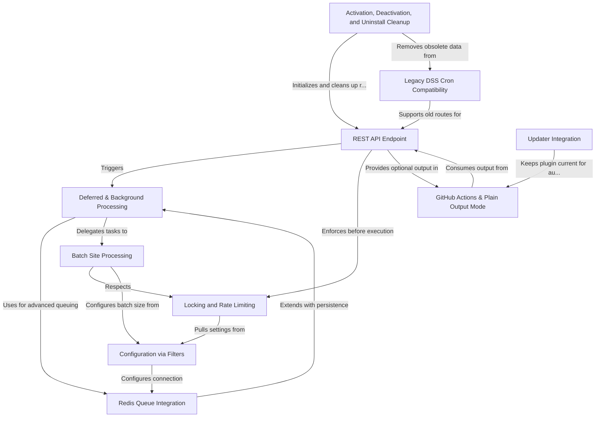

# Tutorial: all-sites-cron

**All Sites Cron** is a WordPress multisite plugin that lets you easily and reliably run cron jobs on *all* public sites in your network, using a REST API endpoint.

It supports **deferred and background processing** for fast responses (great for big networks and automation), optionally using *Redis* for advanced queuing. It helps avoid *overlapping* or *too-frequent* jobs by using **locking** and **rate limiting**, and processes sites in **batches** for stability.

The plugin is easy to configure with WordPress *filters*, supports automation tools like **GitHub Actions**, handles its own updates, and cleans up after activation, deactivation, or uninstall. It also maintains *backward compatibility* with the previous "DSS Cron" plugin for smooth upgrades.

**Source Repository:** [https://github.com/soderlind/all-sites-cron](https://github.com/soderlind/all-sites-cron)

## Chapters

1. [REST API Endpoint
](01_rest_api_endpoint_.md)
2. [GitHub Actions & Plain Output Mode
](02_github_actions___plain_output_mode_.md)
3. [Deferred & Background Processing
](03_deferred___background_processing_.md)
4. [Redis Queue Integration
](04_redis_queue_integration_.md)
5. [Batch Site Processing
](05_batch_site_processing_.md)
6. [Locking and Rate Limiting
](06_locking_and_rate_limiting_.md)
7. [Configuration via Filters
](07_configuration_via_filters_.md)
8. [Updater Integration
](08_updater_integration_.md)
9. [Activation, Deactivation, and Uninstall Cleanup
](09_activation__deactivation__and_uninstall_cleanup_.md)
10. [Legacy DSS Cron Compatibility
](10_legacy_dss_cron_compatibility_.md)

---

Generated by [AI Codebase Knowledge Builder](https://github.com/The-Pocket/Tutorial-Codebase-Knowledge)